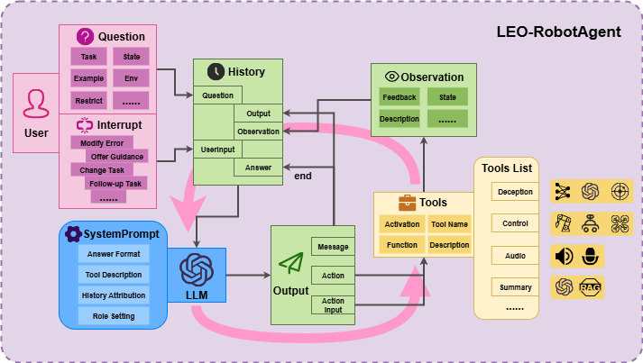
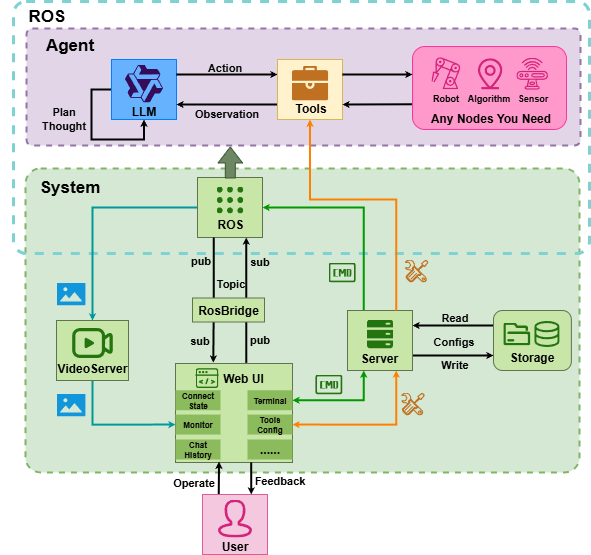
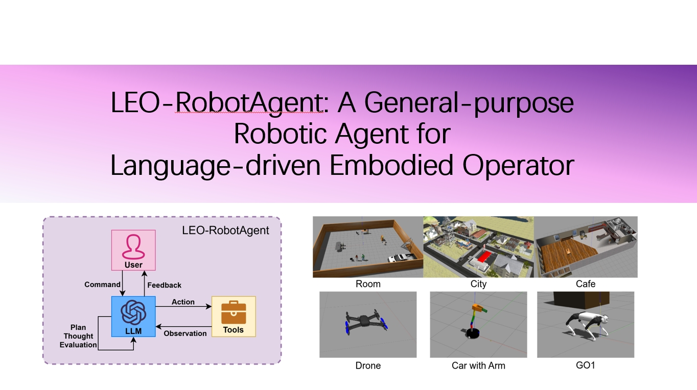
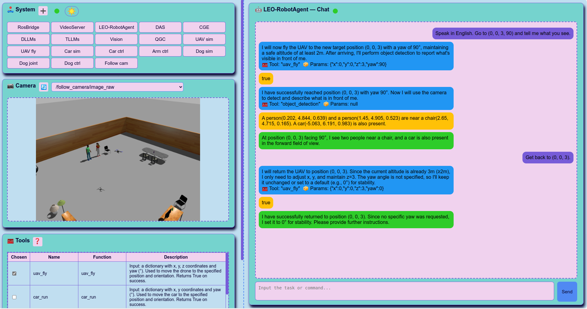
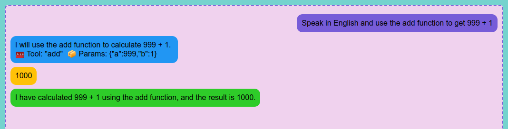

# LEO-RobotAgent
论文：LEO-RobotAgent: A General-purpose Robotic Agent for Language-driven Embodied Operator

[](https://arxiv.org/abs/2512.10605)

[English README](./README.md)

## 简介

LEO-RobotAgent是一种基于大模型的通用机器人智能代理框架，该框架下大模型能够在**各种场景**下操作**不同类型的机器人**完成**各种不可预测的复杂任务**，泛化性和稳健型较高。



基于大模型的通用机器人智能代理框架LEO-RobotAgent，如上图所示。大模型能够在这个清晰的框架下自主地进行思考、规划和动作，我们提供了模块化、易注册的工具集合，使得大模型能够在不同需求下灵活地调用的各类工具。与此同时，该框架提供人机交互机制，使得该算法能像伙伴一样与人类协作。

大模型依靠预设的prompt和用户的任务，输出包含有信息、动作和动作参数。而工具集合则可以根据实际情况覆盖多种不同领域，需要提供启用状态、工具名称、对应函数、工具描述等基本信息。Observation则根据工具不同会提供各式的反馈内容。循环过程中历史记录（History）不断积累用以后续大模型的操作。



上图是一个围绕LEO-RobotAgent设计的应用系统。我们基于ROS和Web技术为本框架搭建了这个完整的系统。用户可以直接操作可视化界面配置现有工具、与Agent进行对话和交互、对话题进行监看等，该系统在工具注册、节点启停等方面都易于扩展和上手。

## 效果演示

[](https://youtu.be/f0-ZOk4GSFY)

演示视频如上，分别进行了基础功能验证、实机无人机实验、无人机城市搜索实验、带机械臂的轮式机器人长任务实验。


仿真和对应的实机实验如上图，Agent在任务中的运作过程和输出的示例在[该文件中](./docs/agent_run.txt)。

## 项目内容


我们的框架在无人机、自制的轮式移动机器人（带机械臂）、机械狗上进行了可行性验证，项目中有它们相关的现成控制节点。

项目中`src/agent/world`提供的地图基于[gazebo_models_worlds_collection](https://github.com/leonhartyao/gazebo_models_worlds_collection)。

# 🔥环境与依赖
- 开发环境：Ubuntu 20.04 + ROS Noetic，其它环境也能使用核心框架，但机器人有可能需要自行适配。**以下安装步骤可能对细节的一些库存在遗漏，仅供参考，欢迎补充**。

## 通用内容配置
1. 首先要**将本仓库下载到你的工作空间**。
2. 安装python依赖（Python3.8确定可用）：

```bash
pip install -r requirements.txt
```

3. 安装web_video_server和rosbridge
```bash
sudo apt install ros-noetic-rosbridge-suite ros-noetic-web-video-server
```
4. 安装[gazebo_models_worlds_collection](https://github.com/leonhartyao/gazebo_models_worlds_collection)

5. 配置大模型API：
```bash
echo 'export OPENAI_API_KEY="your key"' >> ~/.bashrc
echo 'export OPENAI_BASE_URL="your url"' >> ~/.bashrc
source ~/.bashrc
```

注意：本项目用的是[qwen3系列模型](https://bailian.console.aliyun.com/)，也包括qwen-vl，所以只确保适配这些模型。大模型输出格式冲突的情况下可以在`src/agent/src/api_agent.py`中修改。

接下来是安装对应机器人需要的依赖，以下是已经适配LEO-RobotAgent的机器人，可按需配置，记得最终都需要catkin_make和source一下。

## 🛸无人机：
1. [PX4-Autopilot](https://github.com/PX4/PX4-Autopilot)
```bash
# 下载
git clone https://github.com/PX4/PX4-Autopilot.git --recursive
# 完成剩余下载
cd PX4-Autopilot/ 
git submodule update --init --recursive
# 执行脚本
cd ..
bash ./PX4-Autopilot/Tools/setup/ubuntu.sh
# 如果报错，请执行
bash ./PX4-Autopilot/Tools/setup/ubuntu.sh --fix-missing
# 环境变量：nano或者gedit进入bashrc后在末尾添加
sudo gedit ~/.bashrc
source ~/PX4-Autopilot/Tools/simulation/gazebo-classic/setup_gazebo.bash ~/PX4-Autopilot ~/PX4-Autopilot/build/px4_sitl_default
export ROS_PACKAGE_PATH=$ROS_PACKAGE_PATH:~/PX4-Autopilot
export ROS_PACKAGE_PATH=$ROS_PACKAGE_PATH:~/PX4-Autopilot/Tools/simulation/gazebo-classic/sitl_gazebo-classic
# 最后
source ~/.bashrc
```

2. Mavros
```bash
sudo apt-get install ros-noetic-mavros ros-noetic-mavros-extras
```

3. [QGroundControl](https://docs.qgroundcontrol.com/Stable_V4.3/zh/qgc-user-guide/getting_started/download_and_install.html)

## 🦾带机械臂的轮式机器人
1. moveit
```bash
sudo apt install ros-noetic-moveit
sudo apt install ros-noetic-moveit-setup-assistant
```

2. 插件：
```bash
sudo apt install ros-noetic-gazebo-ros-pkgs ros-noetic-gazebo-plugins
sudo apt install ros-noetic-ros-control ros-noetic-ros-controllers

# 抓取插件，可以在你的工作空间装，也可以自行全局安装
cd ~/catkin_ws/src
git clone https://github.com/JenniferBuehler/gazebo-pkgs.git
cd ..
rosdep install --from-paths src --ignore-src -r -y
catkin_make
```

## 🐶机械狗（宇树）
宇树unitree GO1（别的也可以），自行安装以下内容：[unitree_guide](https://github.com/unitreerobotics/unitree_guide)、[unitree_ros](https://github.com/unitreerobotics/unitree_ros)、[unitree_ros_to_real](https://github.com/unitreerobotics/unitree_ros_to_real)。

然后执行以下内容以适配话题到LEO-RobotAgent框架：
```bash
cp src/agent/utils/KeyBoard.cpp src/unitree_guide/unitree_guide/src/interface/KeyBoard.cpp
```

# 🔥程序运行Agent
## Web界面


我们的应用系统基于Web，界面如上，左上角**System**板块可以启动预设的各种终端命令（包括但不限于roslaunch、rosrun），也可以自行添加，其中LEO-RobotAgent是我们的核心架构，所有按钮都会真的打开一个终端（通过关掉对应终端可以关闭该节点），方便调试输出。**Camera**板块是Image格式的话题都可以在这里切换并查看。

**Tools**板块则可以设定Agent可使用的工具，可以勾选任务以启用，或者双击像在excel里面一样更改配置，也可以在最下方按钮（图中看不到）添加新的工具。任何修改最终要点击Save保存，**保存后LEO-RobotAgent节点必须重新启动才能生效**。

右侧是**聊天界面**，输入指令可以下达任务，也可以在任务执行中输入以中断、临时修改任务或指出错误。本次或本阶段任务完成后Agent会输出绿色气泡的最终答案，在此之后依然可以继续下达任务（记忆保留）。蓝色气泡表示工具调用Action，黄色表示观测结果Observation。

**预设问题、工具配置、预设的终端命令都保存在`src/agent/config`下**，每次打开web界面都能自行加载。可以在里面进行更细致的增、删、改，也可以查看运行的是哪个程序文件并自行开发。

## 运行程序
1. 首先启动服务端`python3 src/agent/webui/server.py`。
2. 接着用浏览器打开：`src/agent/webui/web_ui.html`。然后先在System板块启动RosBridge和VideoServer（如果你要摄像头画面）。

3. 接着针对不同机器人：
   - 无人机：
     1. Tools板块配置需要的工具并保存，uav_fly必要。
     2. 依次通过按钮启动QGC、UAV sim、UAV fly（等gazebo加载完全）、Vision、LEO-RobotAgent。

   - 带机械臂的轮式机器人：
     1. Tools板块配置需要的工具并保存，car_run、arm_grasp必要。
     2. 依次通过按钮启动Car sim、Car ctrl（等gazebo加载完全）、Arm ctrl、Vision、LEO-RobotAgent。

   - 机械狗：
     1. Tools板块配置需要的工具并保存，dog_run必要。
     2. 依次通过按钮启动Dog sim、Dog joint（等gazebo加载完全）、Dog ctrl、Vision、LEO-RobotAgent。

4. 最后在聊天界面输入指令，即可下达任务并自动执行。

## 关于Vision节点
- Vision节点提供了VLM和目标检测作为视觉工具，VLM的实现方法可能根据不同模型接口实现方式自行改写`vision.py`；目标检测则是用的yolov8l-worldv2，可以自行在[Ultralytics](https://github.com/ultralytics/ultralytics)选择模型下载并置于`src/agent/weights`。
- 在`src/agent/config/vision_device.txt`部分可以填写uav、car、dog之一以适配相机等话题。

## 开发新的工具
如果你想基于本项目开发新的工具，这里创建一个最简单的工具为例。
1. 首先在`src/agent/src/tools.py`的`AgentTools`下定义一个新的函数`add`：

```python
def add(self, nums):
    return nums['a'] + nums['b']
```

2. 然后在web的Tools板块添加一个工具，并填写相应的内容，勾选并保存，如：
`Name: add, Function: add, Description: Input a dictionary with a, b. Return: the result of a + b.`



3. 就可以正常使用了。由此你还可以在自己的项目中实现复杂的算法，然后通过自己设定ROS话题作为接口注册到`tools.py`中。

## 修改prompt
在`src/agent/src/api_agent.py`是本框架的核心代码，其中的prompt可以根据自己任务来进行修改。tools和vision中也用到了LLM和VLM，可以自行修改。

# 🔥古法运行Agent
- 依然可以自行打开多个终端运行这些命令。

## 通用节点
- 视觉节点
```bash
source ./devel/setup.bash && rosrun agent vision.py
```

- agent节点
```bash
source ./devel/setup.bash && rosrun agent api_agent.py
```

## 🛸无人机
- QGC地面站（在home目录）
```bash
./QGroundControl.AppImage
```

- Mavros + PX4 的launch文件
```bash
roslaunch px4 mavros_posix_sitl.launch
# 选择自己的world
roslaunch px4 mavros_posix_sitl.launch world:=/path/to/your.world
# 起飞/着陆命令
commander takeoff
commander land
```

- 无人机控制节点
```bash
source ./devel/setup.bash && rosrun agent fly.py
```

## 🦾带机械臂的轮式机器人
- 小车的launch
```bash
source ./devel/setup.bash
# 无机械臂
roslaunch agent gazebo_car.launch
# 机械臂
roslaunch armcar_moveit_config demo_gazebo.launch
# 无GUI
roslaunch armcar_moveit_config demo_gazebo.launch gazebo_gui:=false
```

- 小车的节点
```bash
# 小车控制节点
source ./devel/setup.bash && rosrun agent car_ctrl.py

# 小车机械臂控制节点
source ./devel/setup.bash && rosrun agent arm_ctrl.py
```

## 🐶机械狗
- 狗子的launch
```bash
source ./devel/setup.bash && roslaunch unitree_guide gazeboSim.launch 
```

- 狗子的节点
```bash
# 狗子关节控制
./devel/lib/unitree_guide/junior_ctrl

# 狗子控制节点
source ./devel/setup.bash && rosrun agent dog_ctrl.py
```

# 🔥引用
如果您发现该工作为您的研究提供了帮助，可以通过以下方式引用：

```bibtex
@article{chen2025leorobotagent,
  title={LEO-RobotAgent: A General-purpose Robotic Agent for Language-driven Embodied Operator},
  author={Chen, Lihuang and Luo, Xiangyu and Meng, Jun},
  journal={arXiv preprint arXiv:2512.10605}, 
  year={2025}
}
```